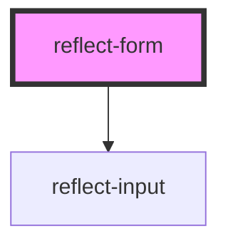

# reflect-form

<!-- Auto Generated Below -->

## Events

| Event           | Description | Type                     |
| --------------- | ----------- | ------------------------ |
| `formSubmitted` |             | `CustomEvent<InputData>` |

## Dependencies

### Depends on

- [reflect-input](../reflect-input)

### Graph

----------------------------------------------

*Built with [StencilJS](https://stenciljs.com/)*
