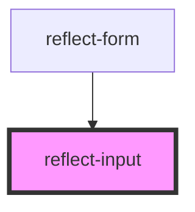

# reflect-input

<!-- Auto Generated Below -->

## Events

| Event          | Description | Type                     |
| -------------- | ----------- | ------------------------ |
| `inputChanged` |             | `CustomEvent<InputData>` |

## Methods

### `clear() => Promise<void>`

Clears input contents

#### Returns

Type: `Promise<void>`

### `getData() => Promise<InputData>`

#### Returns

Type: `Promise<InputData>`

### `setData(data: InputData) => Promise<void>`

#### Returns

Type: `Promise<void>`

## Dependencies

### Used by

 - [reflect-form](../reflect-form)

### Graph

----------------------------------------------

*Built with [StencilJS](https://stenciljs.com/)*
